# Gaussian Process

#### What is a Gaussian Process:

- **Simple explenation**: A Gaussian process is a probability distribution over possible functions that fit a set of points.

- **Deeper understanding**: [Gaussian Processes for Machine Learning](http://www.gaussianprocess.org/gpml/chapters/RW.pdf) gives detailed insights.

#### Topics:

- [2D without noise](#First-lets-draw-samples-from-the-model-without-noise)
- [2D with gaussian noise](#Now-let's-add-gaussian-noise-with-mean-of-0-and-variance-of-1)
- [3D without noise](#2d-is-cool-but-higher-dimensions-are-better)
- [3D with gaussian noise](#Now-add-gaussian-noise-with-mean-of-0-and-variance-of-1)

## First lets draw samples from the model without noise

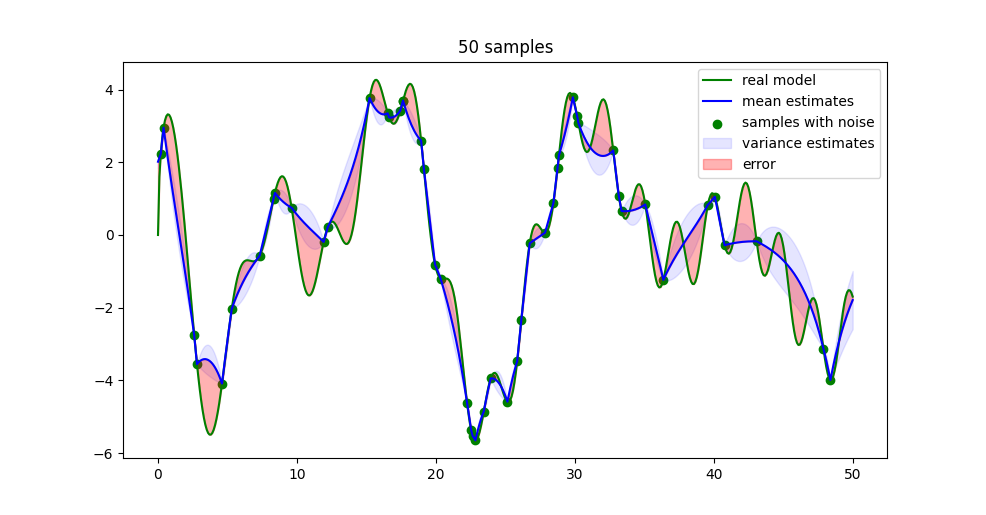
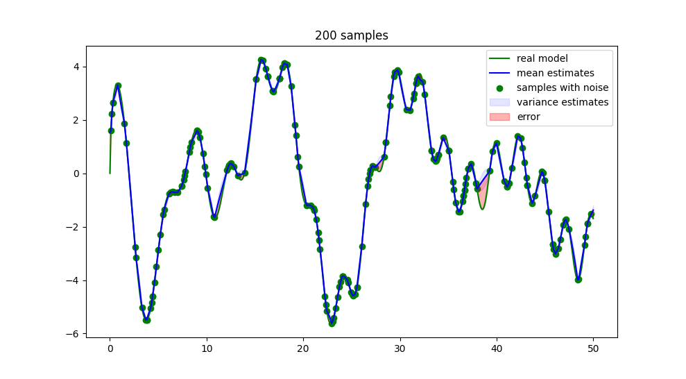
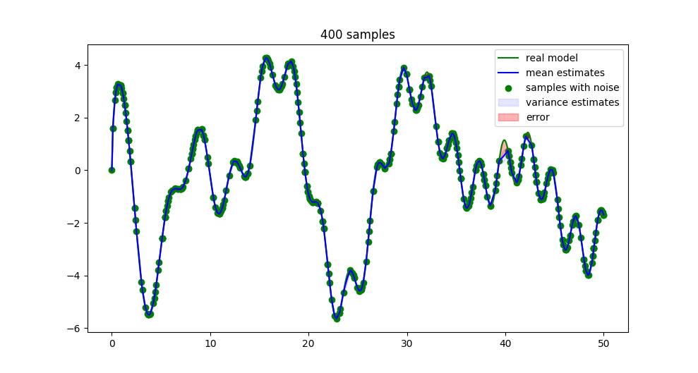

## Now let's add gaussian noise with mean of 0 and variance of 1

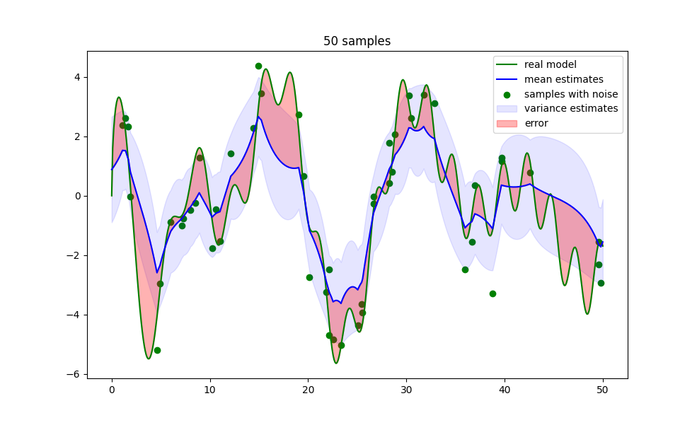
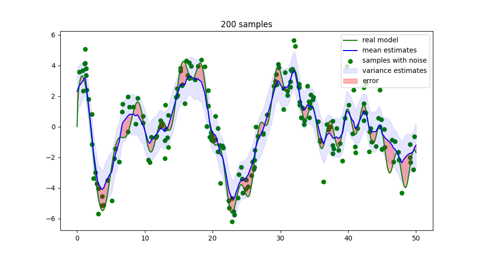
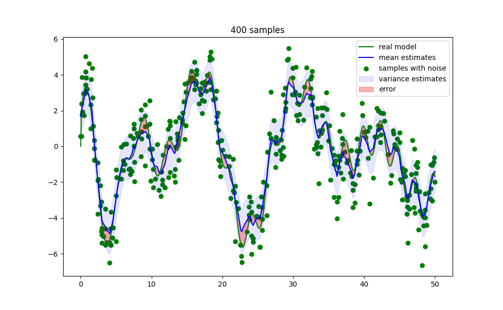

## 2d is cool but higher dimensions are better

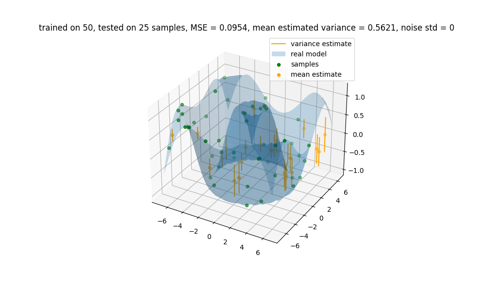
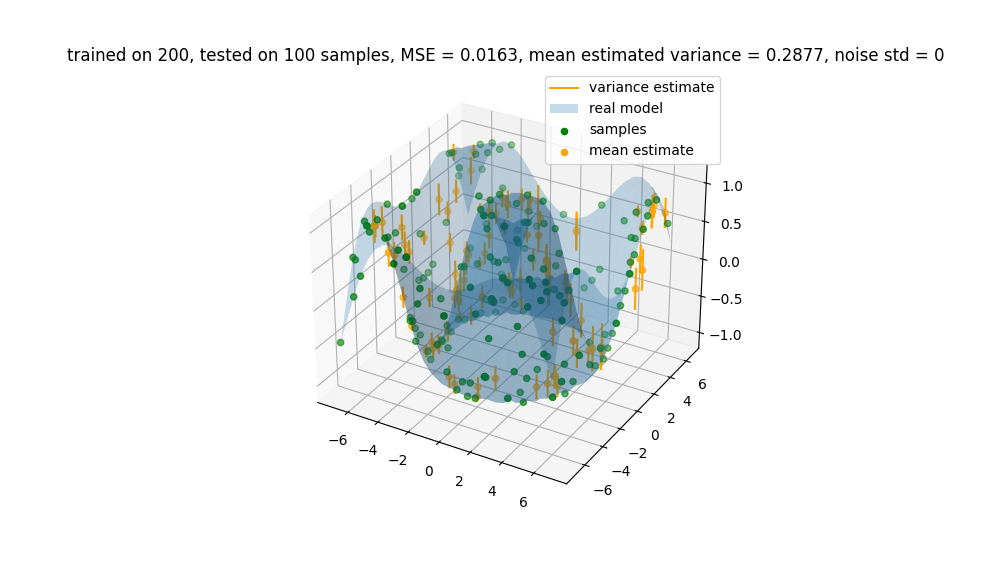
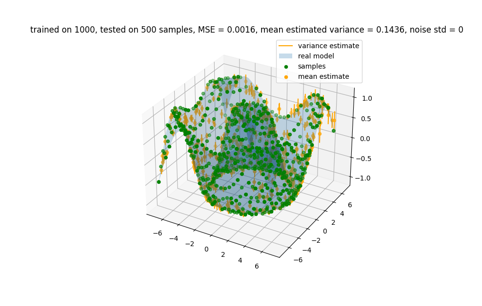

## Now add gaussian noise with mean of 0 and variance of 1

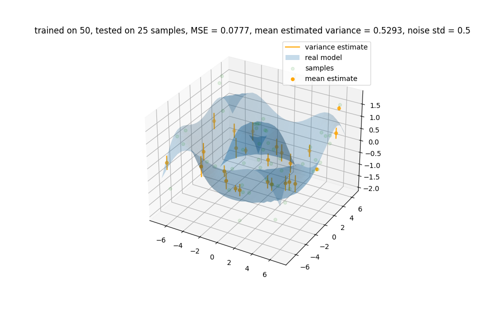
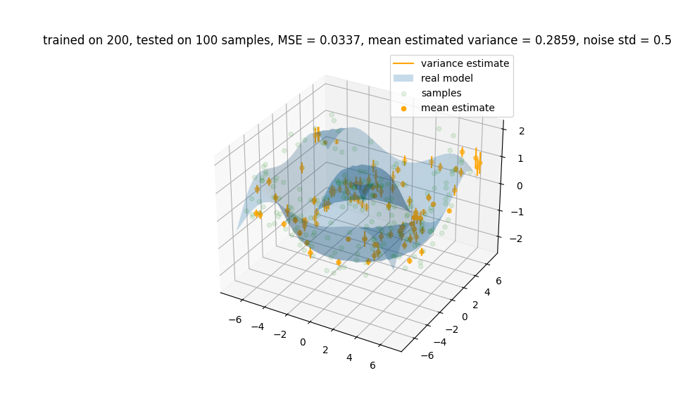
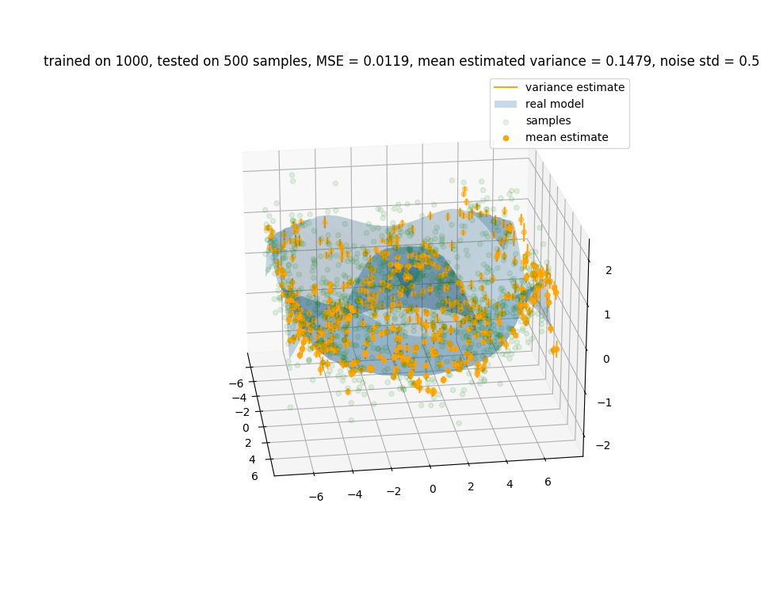
